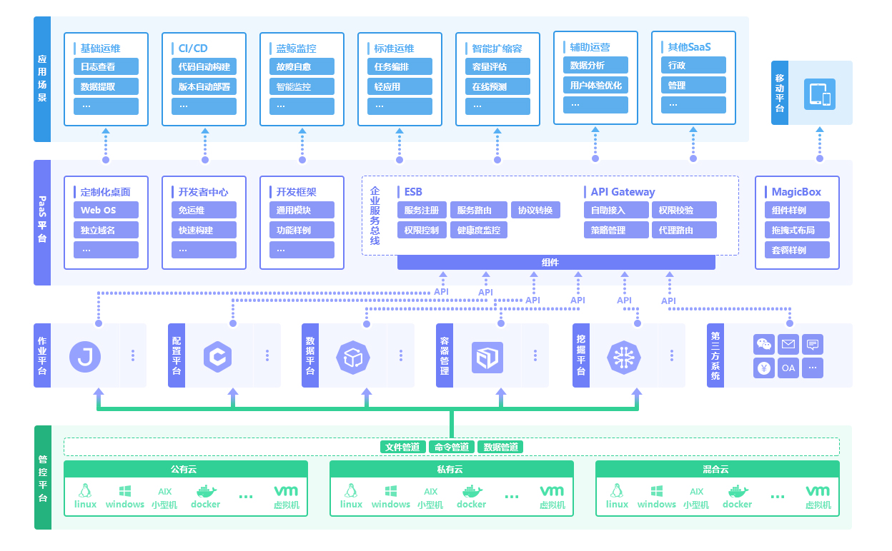
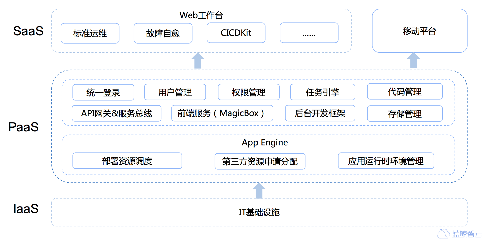

# 蓝鲸智云PaaS平台社区版架构设计

## 蓝鲸智云体系架构

蓝鲸智云体系由八大平台组成，即管控平台、配置平台、作业平台、数据平台、容器管理平台、AI平台、PaaS平台和移动平台，为各种云（公有云、私有云、混合云）的用户提供不同场景、不同需求的一站式技术运营解决方案。

## 蓝鲸智云 PaaS 平台（社区版）架构

蓝鲸智云PaaS平台是一个开放的开发平台，让开发者可以简单、快速地创建、部署和管理应用，他提供了完善的前后台开发框架、API网关、调度引擎、公共组件等模块，帮助用户快速、低成本、免运维地构建支撑工具和运营系统（SaaS应用）。PaaS平台为一个SaaS应用从创建到部署，再到后续的维护管理提供了完善的自助化和自动化服务，从而使开发者可以将全部精力投入到SaaS应用的逻辑开发之中。PaaS平台的主要功能有：完善的开发框架/样例、免运维托管、API网关、前端服务（MagicBox）等。

