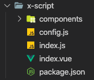

# 蓝鲸智云PaaS平台社区版之可视化开发平台

## 自定义组件开发

### 自定义组件介绍

自定义组件是可视化开发平台提供的一个开放的组件开发能力，开发者可以通过基础组件的组合来定制开发特定场景的业务组件。自定义组件可通过暴露属性配置，让组件的使用更加多样化，将自定义组件集成到平台中，与其他基础组件或者其他自定义组件再次组合，覆盖更多业务场景。

> **下面我们通过自定义组件 `x-script` 来介绍自定义组件的目录结构、开发过程以及生成代码后如何使用。**
>
> **自定义组件 `x-script` 存放在 [`docs/develop/demo_com/x-script`](./demo_com/x-script)。**

### 自定义组件目录结构

自定义组件的目录结构如下：



目录说明如下：
- config.js: 自定义组件暴露给系统的配置
- index.js: 自定义组件的入口
- index.vue: 自定义组件本身的内容
- components 文件夹: 自定义组件本身依赖的其他组件
- package.json: npm 包的描述文件，用于发布自定义组件到 npm 上


#### config.js

`config.js` 是自定义组件暴露给平台的配置，包括如下属性（其中 events 为数组，styles 为数组，props 为对象。具体的写法可参考自定义组件 x-script 的写法）：
- name: 自定义组件在系统中的名字（此属性没有特殊要求，开发者取便于辨认的名字即可）
- type: 此属性非常重要，表示自定义组件最终生成的 dom 标签名
- displayName: 显示在可视化开发平台左侧的名字（此属性没有特殊要求，开发者取便于辨认的名字即可）
- events: 自定义组件暴露出来的事件。无论是 DOM 本身的事件还是自定义事件均可，只要自定义组件本身监听了此事件。事件显示在可视化开发平台右侧事件 tab 中（选中本组件后才会显示出本组件暴露的事件）
- styles: 自定义组件暴露出来的可配置的样式。样式显示在可视化开发平台右侧样式 tab 中（选中本组件后才会显示出本组件暴露的样式）
- props: 自定义组件暴露出来的可自定义配置的属性。属性显示在可视化开发平台右侧属性 tab 中（选中本组件后才会显示出本组件暴露的属性）

> 在目前的版本中，`name`, `type`, `displayName` 必须配置。`events`, `styles`, `props` 非必须配置。其中 `events`, `styles`, `props` 指的是整个自定义组件的事件、样式、属性。如果自定义组件中包含两个组件 A 和 B，想要把 A 和 B 本身的事件、样式、属性也暴露出来，那么需要把 A 和 B 两个组件的事件、样式、属性作为自定义组件整体的事件、样式、属性暴露出来。

#### index.js

`index.js` 是自定义组件的入口，这里的入口有两层含义，一层是指可视化开发平台中渲染、预览这个自定义组件的入口；另一层是指通过可视化开发平台生成 vue 文件之后，这个 vue 文件拿到项目中使用时，项目本身引用这个自定义组件的入口。内容如下：

```js
import xScript from './index.vue'

import componentConfig from './config'

export const config = componentConfig

export default xScript
```

第一行和最后一行代码是导出 vue 组件的传统方法，这两行代码的作用就是可视化开发平台生成 vue 文件之后，项目中使用这个 vue 文件时，项目本身引用这个自定义组件的入口。

第二行和第三行代码是把自定义组件的 config 暴露出来，这两行代码的作用是为了让可视化开发平台本身渲染、预览这个自定义组件。

#### index.vue

`index.vue` 是自定义组件本身的内容，就是一个普调的 vue sfc。这里需要注意两点：
- 这个文件中，vue sfc 的 `name` 属性会忽略，组件的标签由 `config.js` 的 `type` 属性决定，因此这里可以不用设置 `name` 属性。
- 此文件里的 props 应该与 `config.js` 里的 `props` 对应上，如果没有对应，那么会按照 `config.js` 里 `props` 为主。

#### components 文件夹

这个文件夹里存放编写自定义组件时，需要引入的其他组件，如果没有，那么就不需要此目录。

#### package.json

npm package 的描述文件，用于发布自定义组件到 npm 上。在项目中使用自定义组件，我们采取的 npm 包的方案。此文件的具体介绍可查看[官方文档](https://docs.npmjs.com/files/package.json)。


### 自定义组件开发

自定义组件的开发就是纯粹的 vue 组件的开发，比较简单，只要按照自定义组件目录结构创建文件和目录即可。

**需要注意一点，开发自定义组件时，需要在 `$ROOT/lib/client/src/custom/index.js` 中注册自定义组件，注册的方式非常简单，只需要在 `$ROOT/lib/client/src/custom/index.js` 文件中的 `export const customComponentList = [...]` 这个数组中，加入开发的自定义组件即可（数组里的值是自定义组件的文件夹的名字）**


### 自定义组件开发完成后，如何给项目使用？

和可视化开发平台本身渲染、预览自定义组件时需要注册是一样的道理，在项目中使用自定义组件也需要在项目中来注册这个组件。

注册这个组件，首先我们要拿到这个组件，这里我们采取的方案是把自定义组件发到 `npm`，然后在项目中使用 `npm` 安装这个组件，之后在项目中 `Vue.component('自定义组件名称', '自定义组件')` 即可。就和我们的项目要引入其他 vue 组件的方式一模一样。
