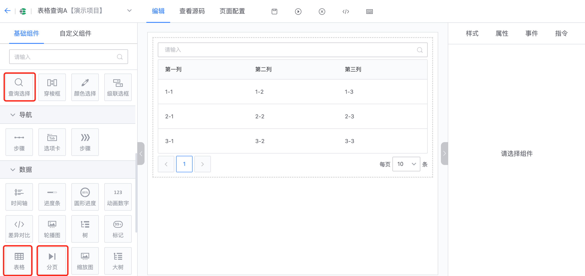
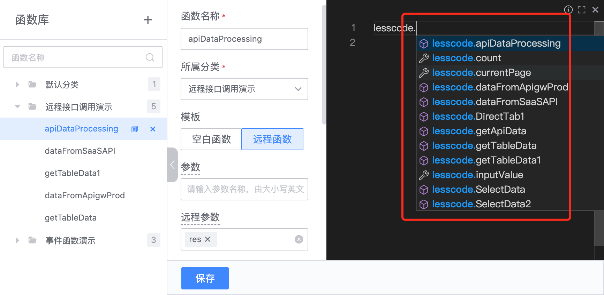
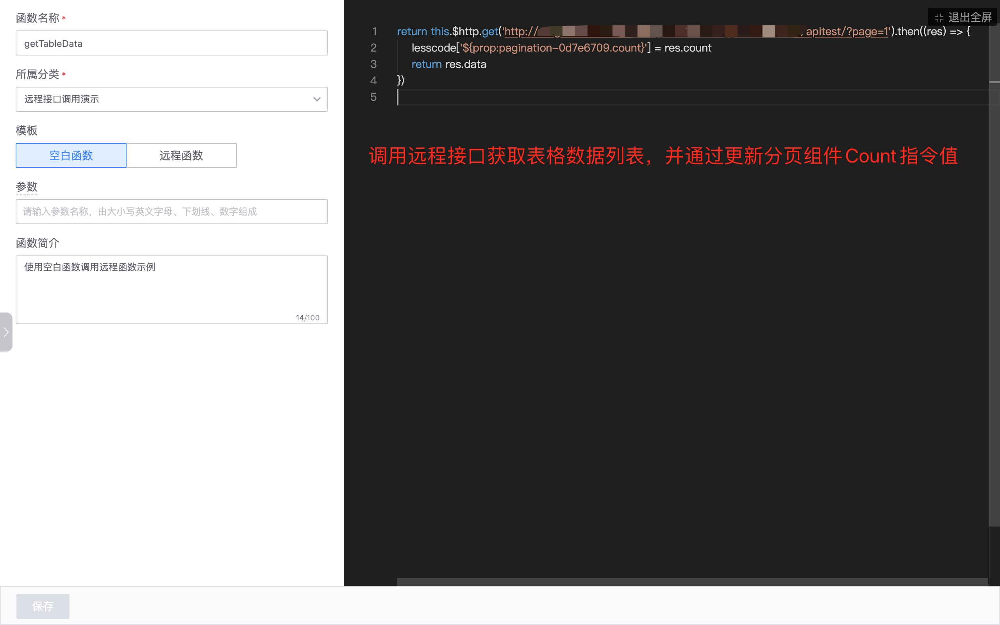
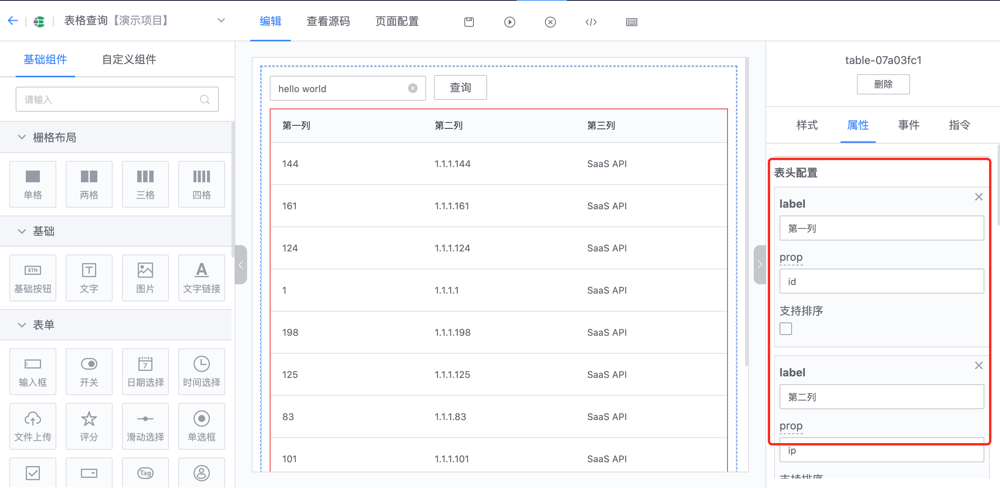
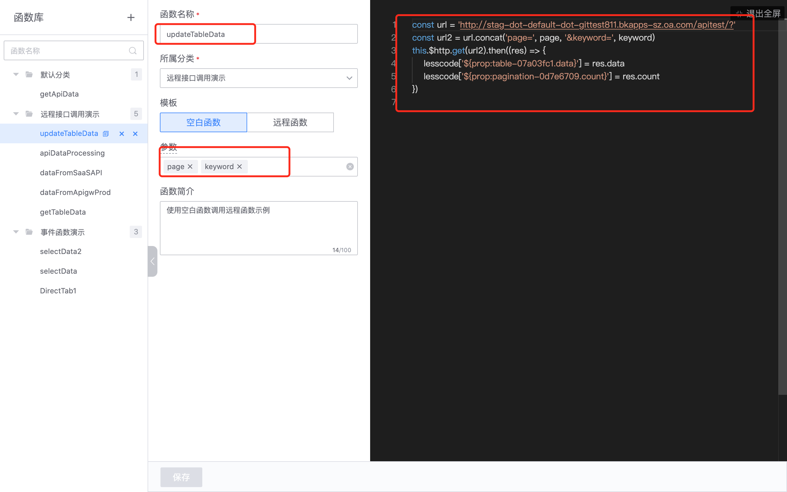
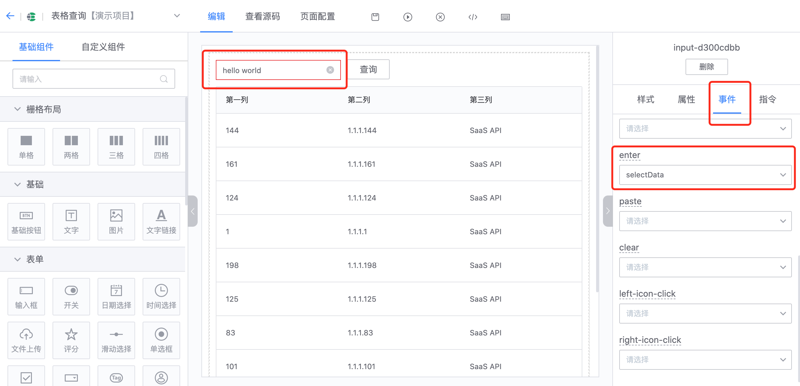
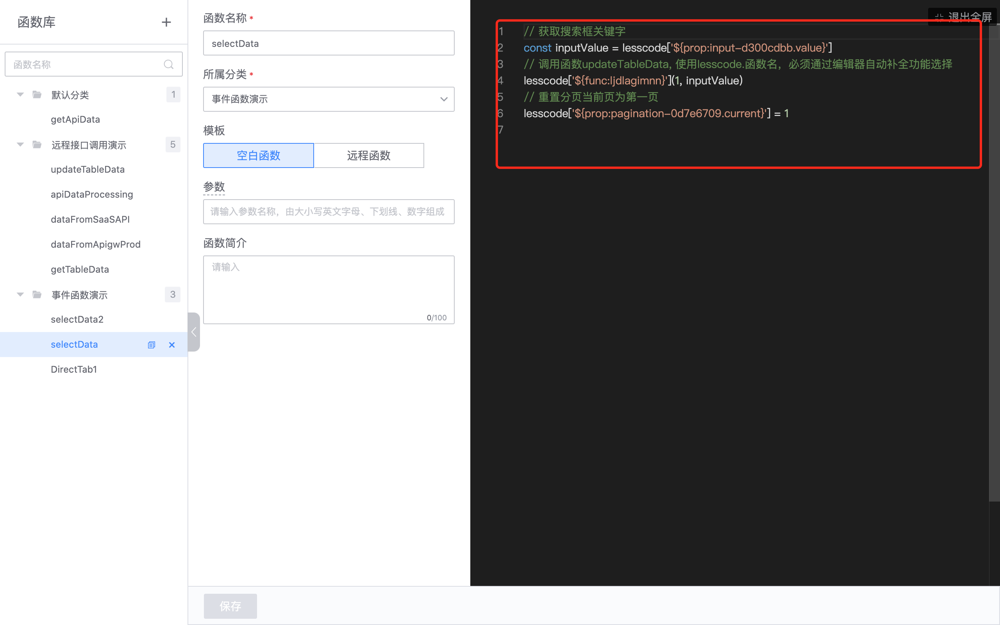
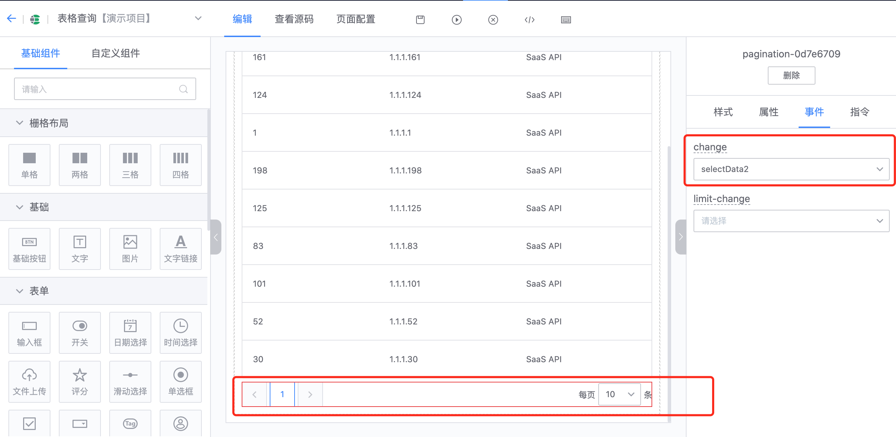
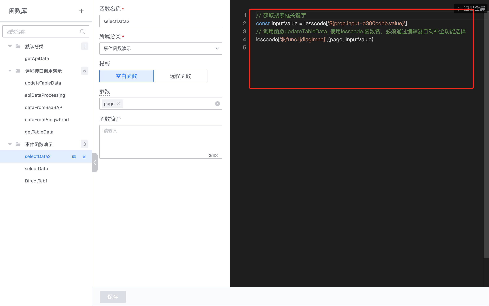
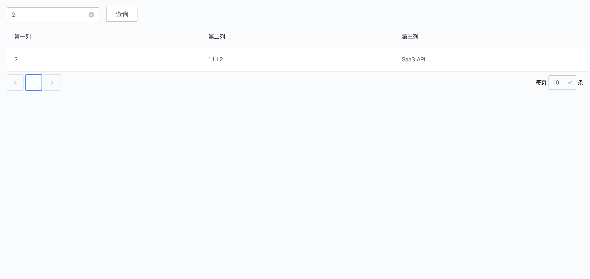

## 如何开发一个表格查询页面
### 第一步：拖拽“查询选择”、“表格”、“分页”组件到画布

### 第二步：配置组件指令

- 配置“表格”组件属性指令“v-bind:data”，用于设置表格数据

- 配置“查询选择”组件属性指令"v-model"，用于获取查询输入关键字

- 配置“分页”组件属性指令“v-bind:count”，用于设置分页数据总量

- 配置“分页”组件属性指令“v-bind:current.sync”，用于获取当前页

**注意：**

编辑函数时

1、可以使用 lesscode.指令值，必须通过编辑器自动补全功能选择对应属性指令值，来获取或者修改当前页面中配置了指令的组件属性值。

2、可以使用 lesscode.函数名，必须通过编辑器自动补全功能选择需要调用的函数。

### 第三步：“表格”组件属性及事件配置

- 配置表格数据源初始加载函数 getTableData

- 根据数据源返回字段配置表头

### 第四步：“查询选择”组件事件配置

- 表格数据更新函数 updateTableData

- 配置“enter”事件函数，触发查询

事件函数 selectData

### 第五步：“分页”组件事件配置

- 配置“click”事件函数，触发分页查询操作

事件函数 selectData2

### 第六步：预览效果

