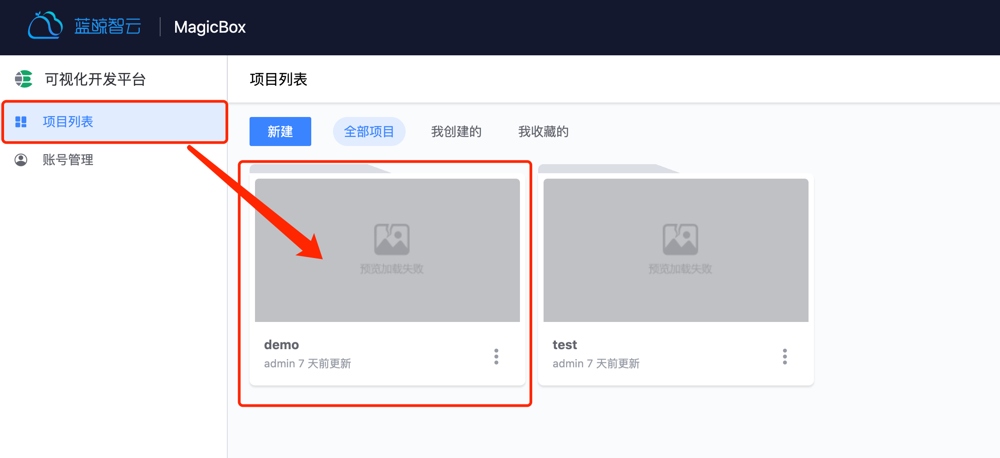
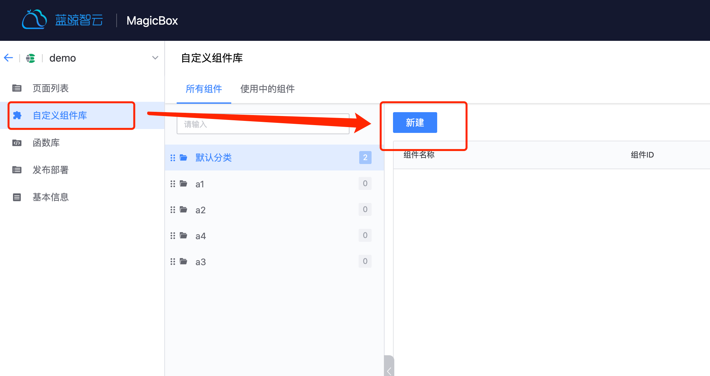
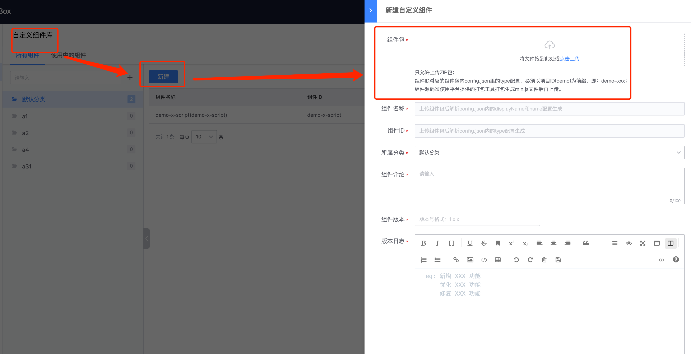
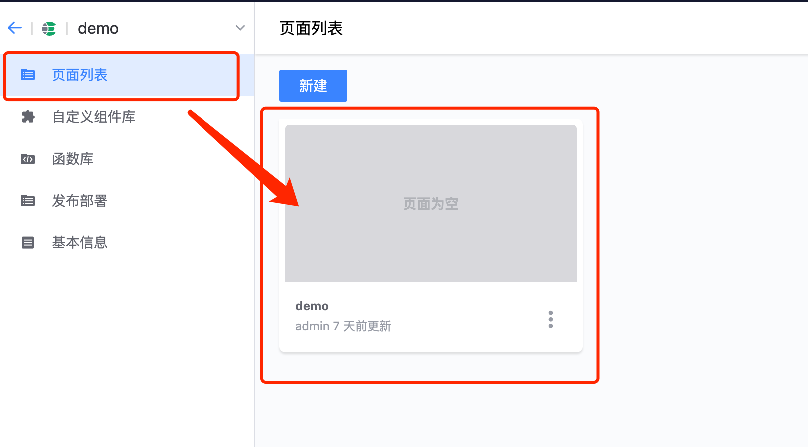
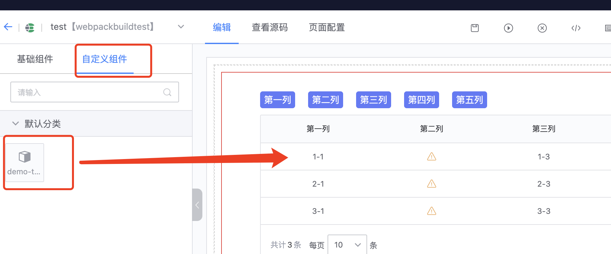
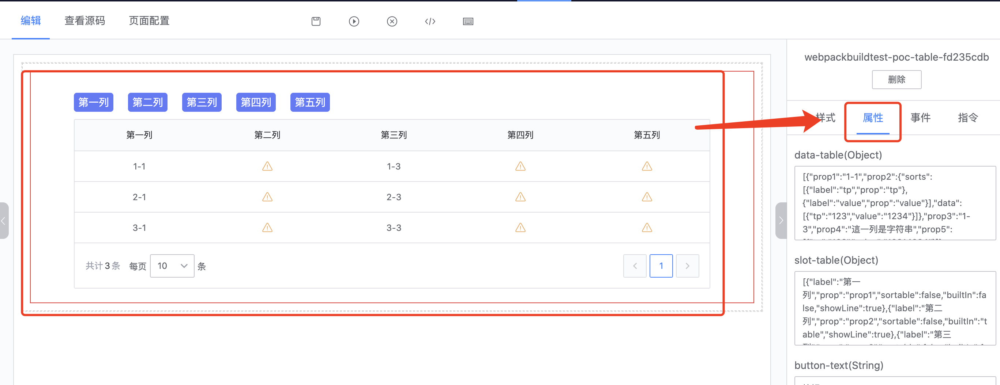

## 自定义组件开发指引

### npm 安装自定义组件打包构建工具

```bash
npm i -g @blueking/lesscode-cli
```

### 自定义组件工程文件结构

[下载 demo 示例包](/static/bk-lesscode-component-demo.zip)

```bash
|-- ROOT/               # 自定义组件根目录
    |-- config.json     # 必须。组件能力配置，自定义组件暴露给 lesscode 的能力说明
    |-- index.vue       # 必须。组件实现源码
    |-- components/     # 推荐。引用的子组件目录
    |   ......          # ajax mock 的实现
    |-- doc/            # 蓝鲸前端开发脚手架的文档工程，这里的细节与实际工程无关，就不详细介绍了，如有兴趣，可自行查看（doc 里的内容不会影响到实际的工程）
    |   ......
    |-- statics/        # 推荐。静态资源目录
    |   ......
```

### 开始创建组件工程

```bash
1. 创建自定义组件工程主目录 component-project
mkdir component-project

2. 进入工程主目录
cd component-project

3. 解压组件开发demo示例包到上述目录

4. 进行组件功能开发（文件 ./index.vue）
touch index.vue

5. 暴露组件给 lesscode 的能力配置（文件 ./config.json）
touch config.json
```

### config.json（暴露给 lesscode 的能力配置）

<table class="table">
    <tr>
        <th>字段 name</th>
        <th>类型 type</th>
        <th>描述 describe</th>
    </tr>
    <tr>
        <td>type</td>
        <td>String</td>
        <td>源码中展示的标签名（只支持小写英文字母）</td>
    </tr>
    <tr>
        <td>name</td>
        <td>String</td>
        <td>页面展示的英文名</td>
    </tr>
    <tr>
        <td>displayName</td>
        <td>String</td>
        <td>页面展示的中文名</td>
    </tr>
    <tr>
        <td>events</td>
        <td>Array</td>
        <td>组件支持的自定义事件</td>
    </tr>
    <tr>
        <td>styles</td>
        <td>
            Array，可选值如下：
            <p>display: 生成的框的类型</p>
            <p>size: css 盒模型（width, height）</p>
            <p>padding: css 盒模型内边距</p>
            <p>margin: css 盒模型外边距</p>
            <p>font: 字体</p>
            <p>border: 边框</p>
        </td>
        <td>支持的 css 样式设置</td>
    </tr>
    <tr>
        <td>props</td>
        <td>Object</td>
        <td>组件支持的属性配置</td>
    </tr>
    <tr>
        <td>directives</td>
        <td>Array</td>
        <td>支持的指令配置</td>
    </tr>
</table>

:::info
events —— 组件内部支持 vue 的自定义事件（this.$emit('click')），配置希望那些事件可以暴露给 lesscode
:::

```js
// events
{
    ...
    events: [
        {
            name: 'click', // 组件支持点击事件
            tips: '响应组件的点击事件' // 事件功能描述
        },
        {
            name: 'foucs', // 组件支持获得焦点事件
            tips: '响应组件的获得焦点事件' // 事件功能描述
        }
    ]
}
```

:::info
props —— 组件支持配置那些 props（与 vue 自定义组件使用方式保持一致）
:::

```js
// props
{
    ...
    // 组件支持配置 value
    value: {
        type: 'string', // 类型（string、number、array、object、boolean）
        val: 'hello world !!!', // 默认值
        options: [] // 值可选列表
        tips: '空白提示', // 数据使用描述
    }
}
```

:::info
directives —— 支持配置那些指令
:::

```js
// directives
{
    [
        ...
        {
            type: 'v-bind', // 指令类型
            prop: 'disabled', // 指令所绑定的属性
            val: '', // 指令绑定的变量名
            modifiers: ['sync'], // 指令修饰符，该字段可选
            defaultVal: false // 指令绑定变量的默认值
        }
    ]
}
```

### 本地调试

#### 自定义组件本地调试步骤：

> 1、初始化一个完整的 vue 应用（使用蓝鲸前端脚手架 [bkui-cli](https://www.npmjs.com/package/bkui-cli)）
>
> 2、运行上一步初始好的前端工程
>
> 3、将开发好的自定义组件作为应用中引用的组件引入应用中（在蓝鲸前端脚手架初始化的工程中，通常是在 components 目录）
>
> 4、在应用中使用你的自定义组件，测试组件的逻辑
>
> 注意应用中的 css 的处理工具需要配置为 postcss

#### 本地开发调试完成后，为保证组件能够在线上使用，需要做以下事情，：
> 1、在组件工程根目录添加 config.json 文件，并按照上面步骤写入配置项
>
> 2、去掉 package.json 中的 vue、bk-magic-vue 等已经由平台内置依赖，以减少组件包体积
>
> 3、去掉应用入口文件中的 `import Vue from 'vue'` 语句，确保自定义组件使用平台提供的 vue 实例，来注册指令、组件等
>
> 4、修改接口调用的方式，本地调试的接口调用统一修改为调用平台函数库的 getApiData 方法，注意本地调试接口与线上接口的字段是否存在差异

### 开发完成打包

```bash
# 完成自定义组件功能开发，进入自定义组件工程根目录的上一级目录，../component-project
cd ../component-project

# 在当前目录打包得到 component-project.zip（需先安装打包工具 npm i -g @blueking/lesscode-cli）
bklc build component-project
```

### 上传

#### 登录蓝鲸可视化开发平台

> 已登陆可回到首页

#### 选择一个应用，进入应用管理

> 在应用列表中选择将要编辑的应用，或者新建一个应用（应用创建成功会自动进入到应用管理页面）



#### 新建自定义组件

> 在左侧可选 tab 中选中自定义组件库，进入自定义组件管理页面
>
> 点击新建按钮进行自定义组件上传操作，如果已上传过自定义组件会展示已上传的自定义组件可以在当前页面进行自定义组件管理操作
>
> 使用中的组件 tab 会展示自定义的使用记录



#### 上传自定义组件（component-project.zip）

> 点击新建按钮会出现自定义组件新建弹框
>
> 操作表单第一项选择将要上传的自定义组件包（component-project.zip）
>
> 上传成功后会自动解析自定义组件包中的 config.json，返回提供的 type、name、displayName 并自动回填到对应的表单项中



### 使用

#### 指定使用组件的页面
> 在页面列表中选择将要编辑的页面，或者新建一个页面来编辑



#### 拖拽组件
> 上传的组件在页面编辑页面会自动注册
>
> 进入页面编辑页面选中自定义组件 tab
>
> 找到将要使用的组件拖拽到编辑区



#### 编辑组件功能
> 在编辑区选中将要操作的组件
>
> 在右侧配置面板选中将进行的操作 tab 完成页面功能配置


