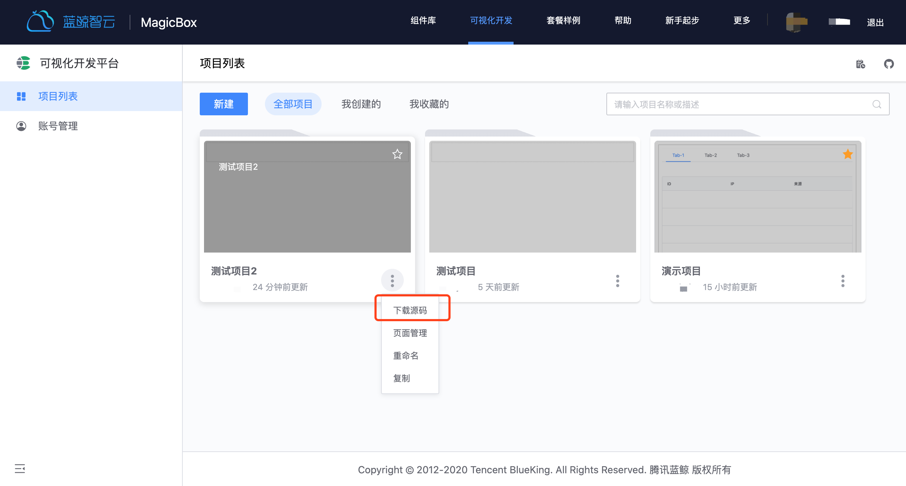
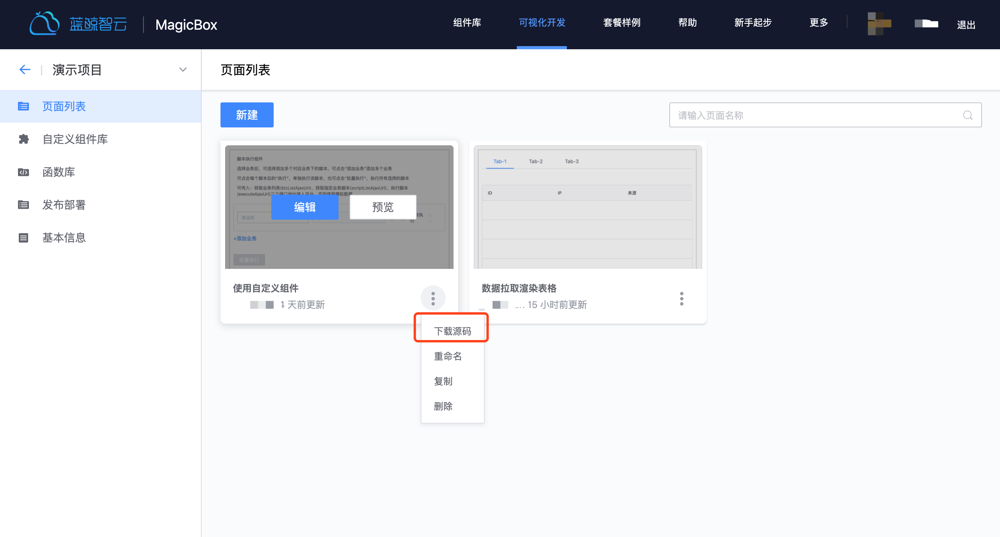

## 项目二次开发指引

## 方式一：下载整个项目源码包进行二次开发
下载项目源码，平台将会把项目的所有页面源码及页面路由配置集成到[蓝鲸前端开发框架（BKUI-CLI）](https://bk.tencent.com/docs/document/5.1/19/583)中，作为项目整个源码包下载下来。



下载后你可以通过下边几个步骤进行二次开发和部署：

1. 在Git上创建新代码仓库（New Project），解压下载下来的源码包，并把源码提交到新创建的代码仓库里，目录结构如下

```bash
├── README.md
├── lib/                    # 源码目录
│   ├── client/             # 前端源码目录
│   │   ├── build/          # 前端构建脚本目录
│   │   │   ......
│   │   ├── index-dev.html  # 本地开发使用的 html
│   │   ├── index.html      # 生产环境使用的 html
│   │   ├── src/            # 前端源码目录
│   │   │   ├── App.vue     # App 组件
│   │   │   ├── main.js     # 主入口
│   │   │   ├── api/        # 前端 ajax 目录
│   │   │   │   ......
│   │   │   ├── common/     # 常用前端模块目录
│   │   │   │   ......
│   │   │   ├── components/ # 前端组件目录
│   │   │   │   ......
│   │   │   ├── css/        # 前端 css 目录
│   │   │   │   ......
│   │   │   ├── images/     # 前端使用的图片存放目录
│   │   │   │   .....
│   │   │   ├── mixins/     # 前端使用的 mixins
│   │   │   │   ......
│   │   │   ├── router/     # 前端 router 目录
│   │   │   │   ......
│   │   │   ├── store/      # 前端 store 目录
│   │   │   │   ......
│   │   │   ├── views/      # 前端页面目录
│   │   │   │   ......
│   │   └── static/         # 前端静态资源目录
│   │       ......
│   └── server/             # 后端源码目录
│       ├── app.browser.js  # 服务器启动文件
│       ├── logger.js       # 后端日志组件
│       ├── util.js         # 后端工具方法
│       ├── conf/           # 后端配置文件目录
│       │   ......
│       ├── controller/     # 后端 controller 目录
│       │   ......
│       ├── middleware/     # 后端中间件目录
│       │   ......
│       ├── model/          # 后端实体目录
│       │   ......
│       ├── router/         # 后端路由目录
│       │   ......
│       ├── service/        # 后端服务目录
│       │   ......
├── nodemon.json            # nodemon 配置文件
├── package.json            # 项目描述文件
```

2. 在蓝鲸PaaS平台里创建应用模块。

    注意：
    - 应用模块源码管理选择“代码库”，并绑定第一步创建的代码仓库。
    - 开发语言及初始模板选择“Nodejs ->蓝鲸应用前端开发框架”。

        

3. 二次开发提交代码到仓库，进入蓝鲸PaaS平台应用模块部署页面，部署即可。

## 方式二：下载项目单个页面源码进行二次开发
如果开发场景是在已有项目里新增功能页面，那你可以拖拽布局单独页面后，直接下载独立页面源码，集成到已有项目工程里。


