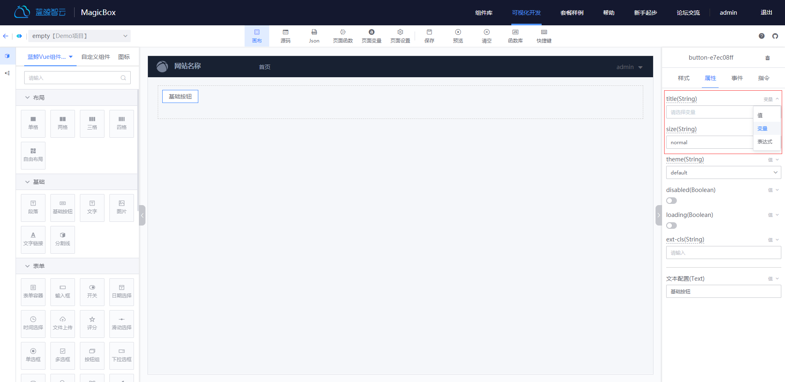
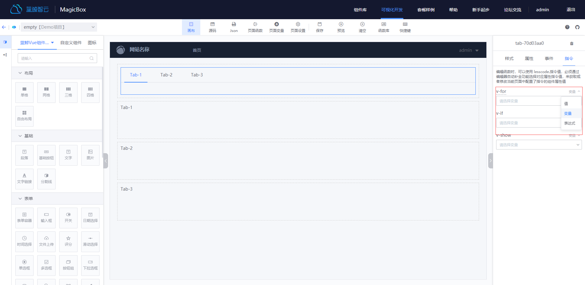
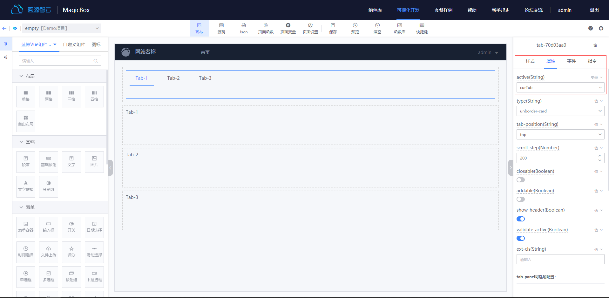
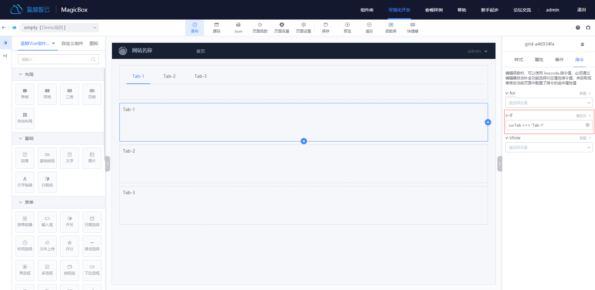
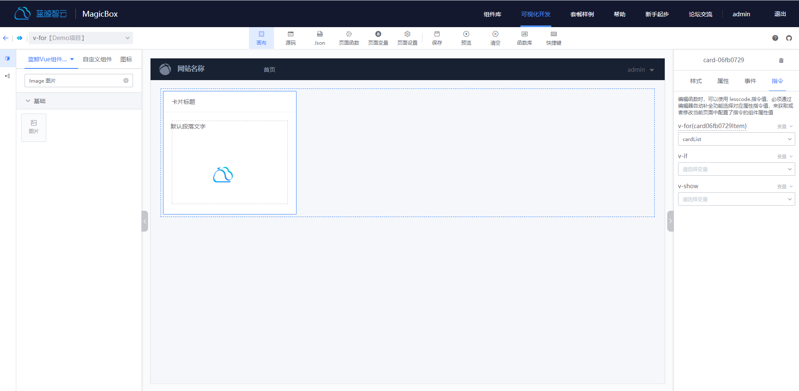
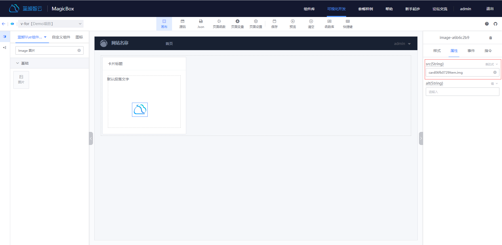
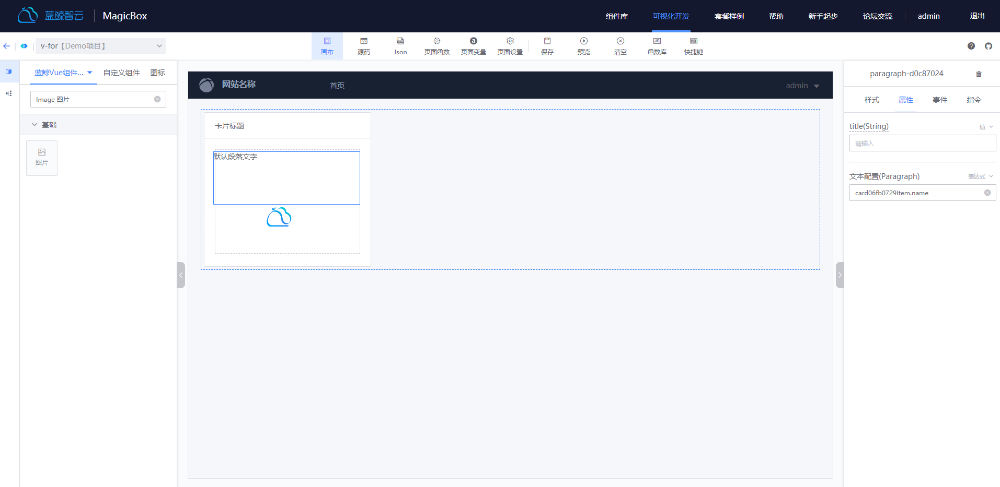
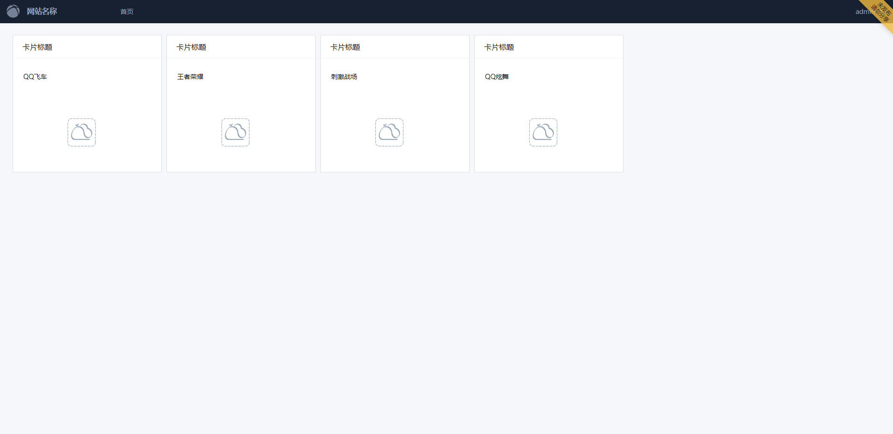

## 指令使用指引
---
蓝鲸可视化开发平台中：可以通过[VUE 指令](https://cn.vuejs.org/v2/api/#%E6%8C%87%E4%BB%A4)完成更多业务开发，通过指令可以完成以下功能：
* 通过配置属性相关的指令，可以做到动态修改组件的值，也可以在函数中获取该属性的值，用于后续的业务开发
* 通过配置指令面板的指令，可以做到渲染多个元素、控制元素是否显示和在表单控件或者组件上创建双向绑定

### 配置属性相关的指令
---
#### 配置方式：
:::info
* 打开画布编辑页面
* 在画布编辑区，使用鼠标选中某个组件
* 在右侧配置区域，将Tab切换到属性面板
* 找到某个想配置的属性，点击属性的右上角可以进行切换，可以切换为变量或者表达式
* 选择变量或者填入表达式
:::

#### 使用说明：
* 属性切换为变量并且选择变量后，该属性的值将会和该变量绑定。可以在函数中修改该属性的值，也可以在函数中获取该属性的值。注：函数中可以使用`lesscode.`来唤起变量选择，可以选择绑定到某个属性的变量
* 属性切换为指令并且填入表达式后，该属性的值将会由表达式计算而来。可以填入类似`lesscodeVar.inputValue`这种对象取值的表达式，也可以是`'perfix' + inputSearchVar`这种表达式。注：表达式中可以使用该页面的变量和JS提供的全局属性，其余变量将会当作`undefined`处理

### 配置指令面板的指令
---
#### 支持的指令：
目前支持了 `v-if` `v-show` `v-for` `v-model` `v-html`
#### 配置方式：
:::info
* 打开画布编辑页面
* 在画布编辑区，使用鼠标选中某个组件
* 在右侧配置区域，将Tab切换到指令面板
* 找到某个想配置的指令，点击属性的右上角可以进行切换，可以切换为值、变量或者表达式
* 选择变量或者填入表达式
:::

#### v-if、v-show 使用说明
> v-if 和 v-show 都是控制元素是否显示，区别在于`v-if`会控制Dom元素是否渲染来控制元素是否显示，`v-show`会控制元素的`display`属性来控制元素是否显示。下面实例演示如何使用`v-if`:
:::info
* 画布拖入`Tab`和3个`Grid`组件
* 选中`Tab`组件，切换到属性面板，给`active`属性绑定一个变量`curTab`(如下图一所示)
* 为了区分三个`Grid`组件，分别拖入`Paragraph`组件，并写入一个文字以区分
* 选中`Grid`组件，切换到指令面板，将`v-if`切换为表达式，并填入`curTab === 'Tab-1'`,其余两个`Grid`组件同样配置(如下图二所示)。注: `Tab-1`是`Tab`组件配置的三个tab的值
* 即完成切换tab的时候，展示不同grid的需求(如下图三所示)
:::

#### v-for 使用说明
> `v-for`指令可以将一组数据渲染成一组元素。下面实例演示如何使用`v-for`:
:::info
* 画布拖入`Card`组件，`Card`组件内部拖入一个`Paragraph`组件`Image`组件
* 选中`Card`组件，切换到指令面板，给`v-for`指令绑定一个变量`cardList`(如下图一所示)。注：应用里面需要存在变量`cardList`，它是一个有4个子元素的数组，每个子元素都有`img`和`name`属性
* `v-for`指令上面的显示的`card06fb0729Item`，可以为当前组件和子组件的指令赋值，当前组件的 v-if 和 v-show 除外
* 选中`Image`组件，给组件的`src`属性填入表达式`card06fb0729Item.img`(如下图二所示)。注：变量`cardList`的子项`card06fb0729Item`需要有`img`属性
* 选中`Paragraph`组件，给组件的`文本配置`属性填入表达式`card06fb0729Item.name`(如下图三所示)。注：变量`cardList`的子项`card06fb0729Item`需要有`img`属性
* 即完成将一组数据渲染成一组元素(如下图四所示)
:::

#### v-model，v-html 使用说明
> 不是所有组件都支持 v-model，v-html，下面具体介绍如何使用
:::info
* v-model：在表单控件或者组件上创建双向绑定，目前在表单控件类型组件上支持该属性。可以用 v-model 指令在表单元素上创建双向数据绑定。它会根据控件类型自动选取正确的方法来更新元素，具体查看[表单输入绑定文档](https://cn.vuejs.org/v2/guide/forms.html)。
* v-html：用于更新元素的 innerHTML，目前在`Paragraph`组件上支持该属性。
:::