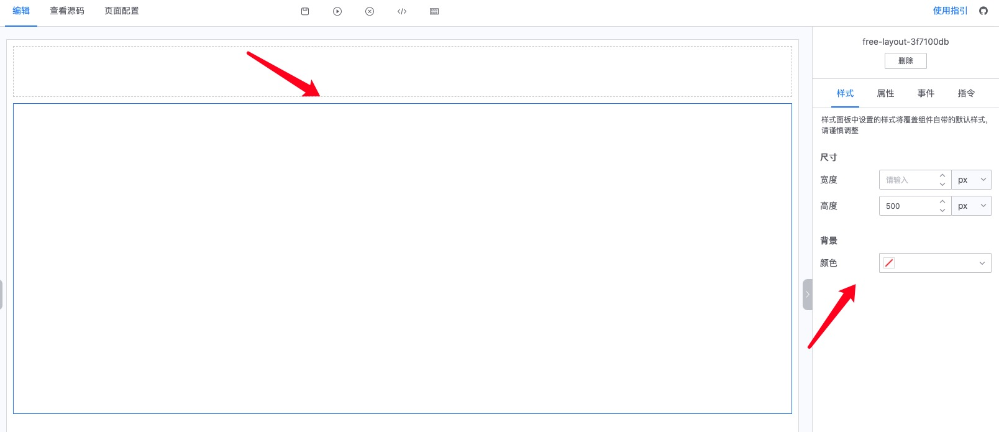
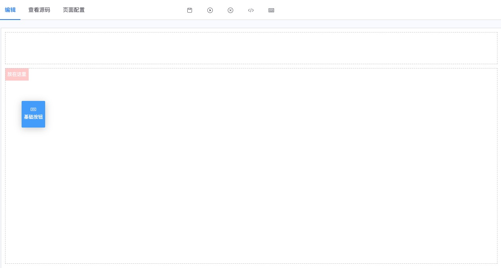
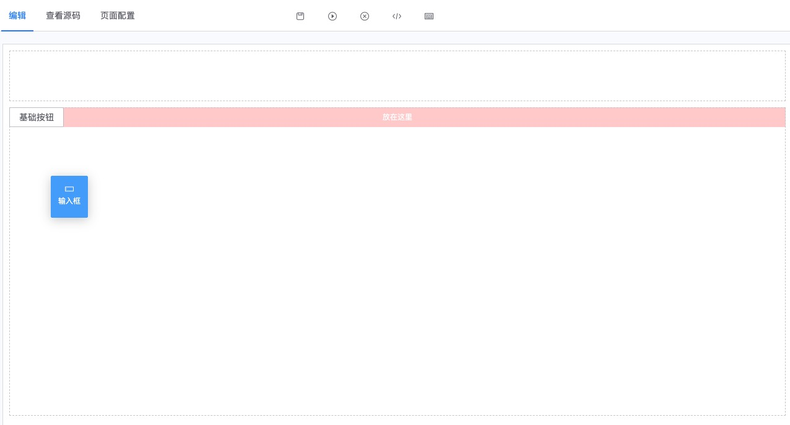
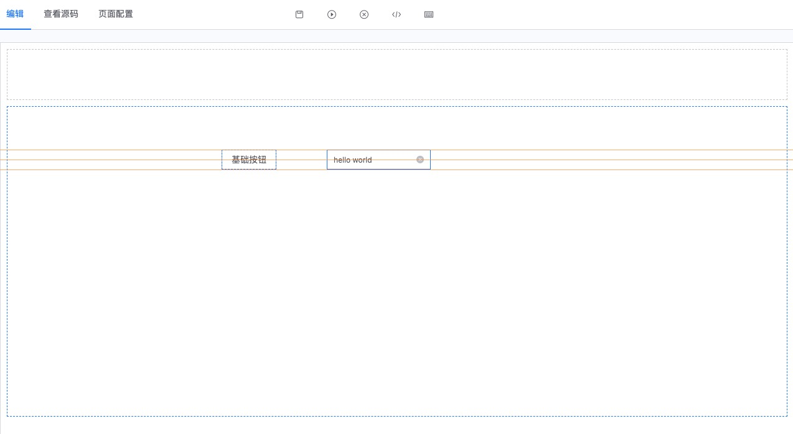
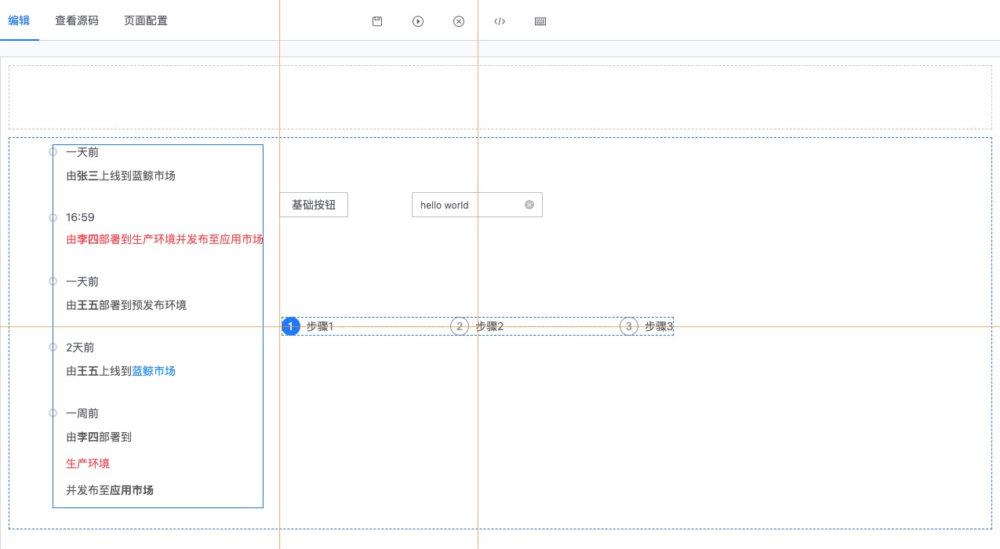

## 布局 - 自由布局

:::info
可视化开发布局支持栅格布局和自由布局，这里介绍自由布局
:::

### 自由布局是默认高度为 500px，背景透明的一块区域，高度、宽度和背景色可以通过右侧的样式面板修改

### 初次从左侧面板拖入组件到自由布局中，默认放置在自由布局的左上角

### 自由布局里的组件可以随意的拖动，拖动的过程中，组件和组件之间会有黄色辅助线，同时会有 3px 的吸附效果，帮助你方便的对齐组件

### 自由布局与栅格布局的关系

可视化开发的画布支持三种类型，栅格布局、自由布局和普通组件，他们之间关系是

- 自由布局中只能放入普通组件，不能放入栅格布局和自由布局
- 自由布局里的普通组件不能拖入到栅格布局中，也不能拖到另外的自由布局中
- 栅格布局中可以放入栅格布局、自由布局和普通组件
- 栅格布局里的普通组件可以拖入到另外的自由布局以及另外的栅格布局中
- 栅格布局里的栅格布局和自由布局不能拖入到另外的自由布局以及另外的栅格布局中
