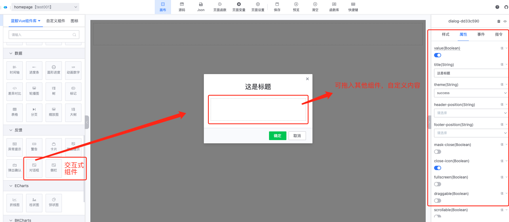
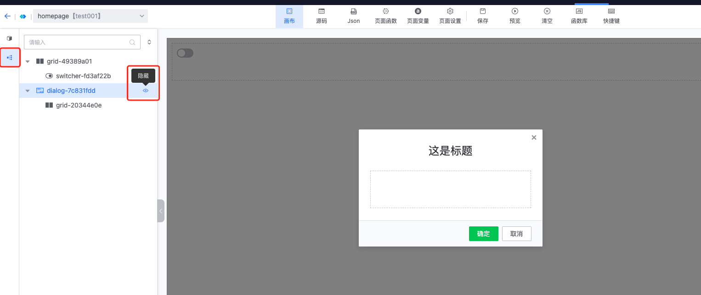
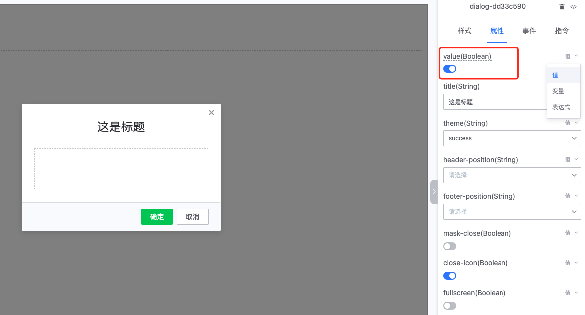
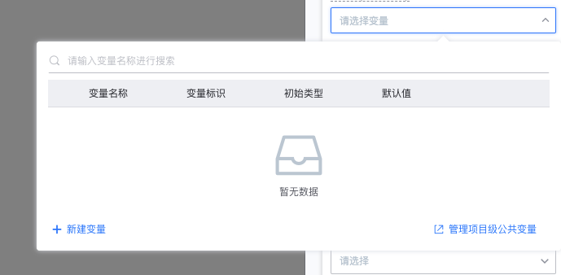
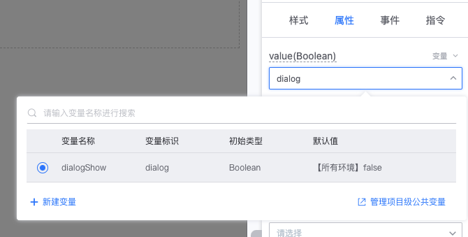
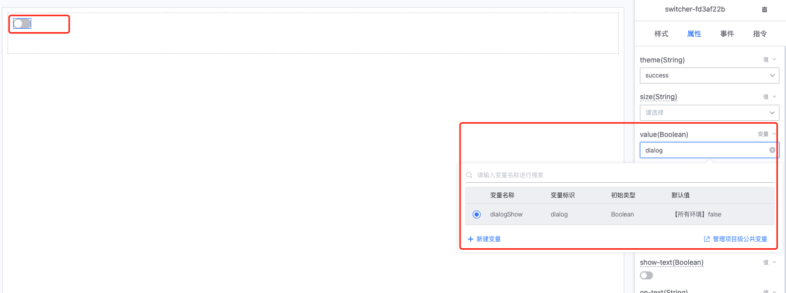
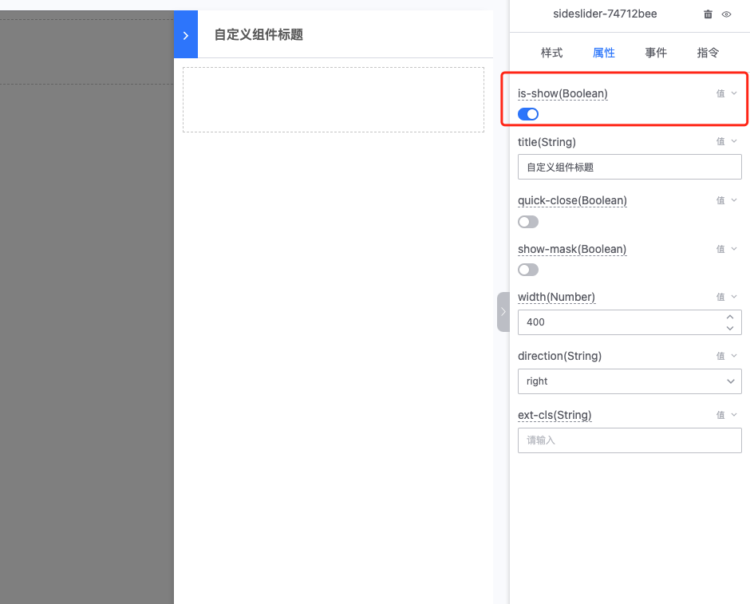

## 交互式组件使用指引

### 什么是交互式组件

不同于常规的`button`、`text`等组件，交互式组件允许用户通过变量控制组件在某种状态下打开或关闭改组件，组件具有与特定的条件具有强绑定关系。比如`dialog对话框`组件，它一般不会长久驻留并显示的组件，而是某种情况下（比如表单提交、公告展示）等触发后才会展示，此类组件称之为**交互式组件**

当前平台可用的交互式组件有`对话框`、`侧栏`。

### 交互式组件的使用

与常规组件一样，从左侧组件库拖入画布，并通过右侧面板配置其属性；交互式组件的内容区是`Layout`插槽，即可在其内容区拖拽其他组件，自定义交互式组件的内容。

:::info
交互式组件在激活时，将占满屏幕与画布，因此在画布编辑区，同一时刻仅可编辑一个交互式组件。 

如果需要切换组件时，可切换左侧面板至组件树，并在组件树中点击组件以激活想要编辑的组件。

交互式组件右侧的眼睛图表可点击关闭、打开当前交互式组件的显示状态。
:::

### 交互式组件的注意事项

#### 状态绑定
::: warning
交互式组件在任何情况下，都应该绑定一个变量去决定其展示与否，静态的值将使其无法正常交互。

这里将对`对话框`和`侧栏`两个组件分别的状态绑定做详细说明
:::

---

对话框组件通过`v-model`（即`value`）绑定其状态，控制显示与否，默认状态下为值类型，是静态类型。在这种状态下，交互式组件在真实环境中是无法正常工作的，因此需要为其绑定变量或表达式。

value属性右上角选择变量,并在下拉中新建变量

新增变量，注意初始类型选择`Boolean`， 并根据实际情况设置其默认值（一般情况下默认值为`false`，需要通过一定的条件进行触发）

创建完成后，在变量的下拉中，选中刚刚创建的变量

最后，只需要在需要其出现的情况下，将该变量改为`true`即可。 

这里为了进行模拟，创建一个`switcher`组件，并绑定同样的变量，这样当`switcher`打开时，弹框即会出现，反之将消失。

---

`侧栏`组件的状态绑定属性是`is-show`，其配置方式与`对话框`一致，请参考上面配置步骤

