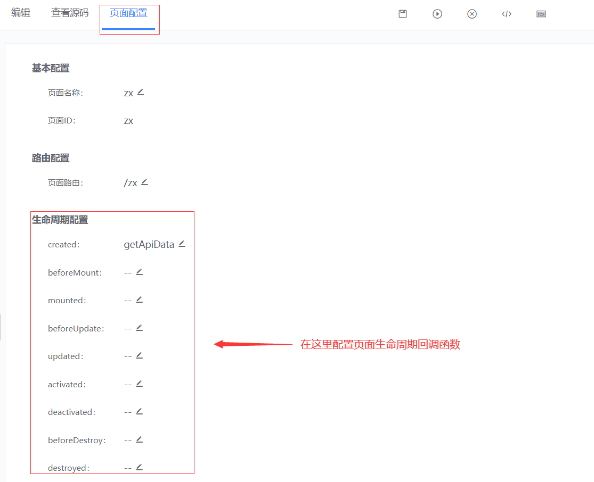
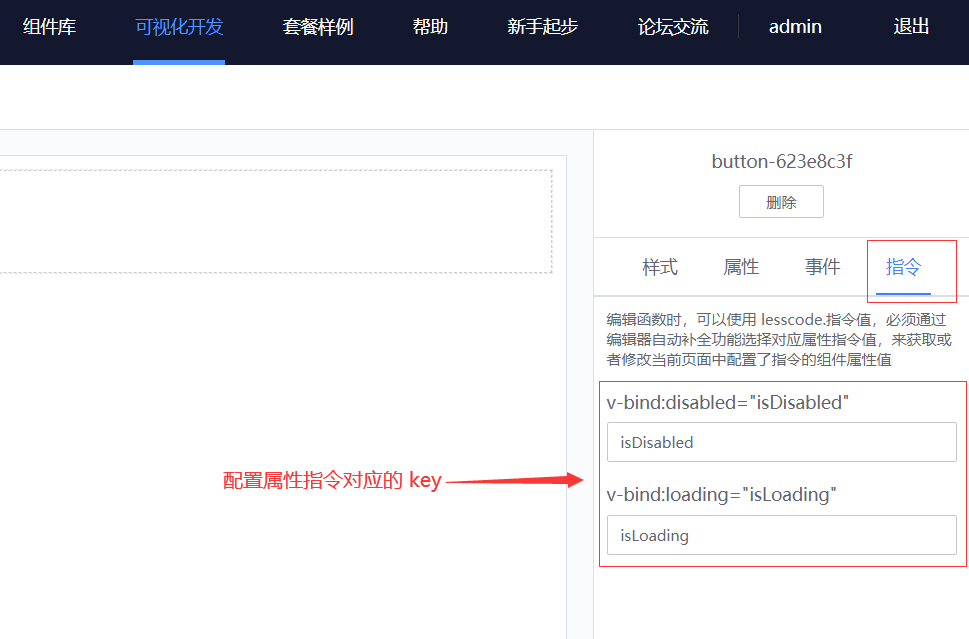
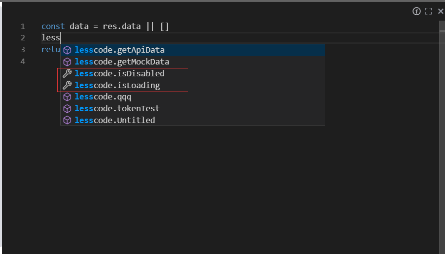
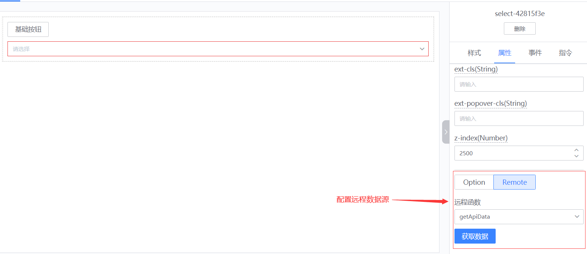
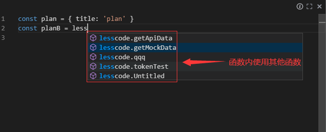

## 函数使用指引
---
蓝鲸可视化开发平台中：可以由用户自行编写函数，并在页面中使用函数。通过使用函数，可以完成以下需求：
* 编写空白函数：使用 js 语法编写代码，可以发起 ajax 请求，获取接口数据，然后进行业务处理
* 编写远程函数：通过后台转发的形式，发起 ajax 请求，转发的请求可以通过配置的方式来携带更多的数据
* 函数配合组件事件：在组件事件触发的时候，执行相应的函数，来完成相关业务
* 函数配合页面生命周期：在页面管理 tab 下，配置生命周期用到的函数，在函数中进行相关业务处理
* 函数配合指令：组件的指令配置页面，可以配置属性的指令变量名，然后在函数中，使用或者修改属性值
* 函数绑定组件数据源：在组件的部分属性中，可以通过绑定远程数据源来设置初始化数据
* 函数中调用函数，调用其他组件：编写函数时，可以通过编辑器自动补全功能使用函数，也可以通过 js 调用组件库组件

### 函数管理入口
---
#### 函数管理页面路径：
首页 -> 项目管理 -> 函数库
#### 函数管理页功能如下：
* 页面左侧面板可以新增，搜索和选择函数组。函数组主要用户将项目中的函数进行归类，方便后续查找和管理函数
* 左侧面板可以通过拖拽的方式对函数组排序，方便管理函数
* 页面右侧面板可以新增，搜索，修改，删除和复制函数。主要管理当前项目下的所有函数

### 函数管理弹窗
---
#### 函数管理弹窗打开方式：
页面 -> 画布编辑 -> 函数管理弹窗
#### 函数管理弹窗功能如下：
* 左侧面板可以选择，删除，新增和复制函数
* 右侧面板可以填写相关函数内容
* 右上角有全屏按钮，点击可以进行全屏编写函数

### 函数类型介绍
---
蓝鲸可视化开发平台目前提供了空白函数和远程函数两种函数类型，以便业务发开使用。后续将会添加更多的函数类型，敬请期待
#### 空白函数：
* 空白函数，函数内容完全由用户编写
* 这里编辑管理的函数，用于画布页面的属性配置和事件绑定
* 用于属性时：函数需要返回值，该返回值将会赋值给属性
* 用于事件时：函数将在事件触发时执行
* 可以使用 lesscode.指令值，必须通过编辑器自动补全功能选择对应属性指令值，来获取或者修改当前页面中
   配置了指令的组件属性值
* 可以使用 lesscode.方法名，必须通过编辑器自动补全功能选择对应函数，来调用项目中的函数
* 用于属性时示例如下：
    return this.$http.get("http://apiHost.com/api/data/getMockData").then((res) => {
        return res.data
    })

#### 远程函数：
* 远程函数，系统将会根据参数组成 Ajax 请求，由后台转发该请求，用户在这里编写 Ajax 回调函数
* 如果项目进行二次开发，可以通过配置 `lib/serve/conf/token.js`，来让转发请求携带更多数据
* 这里编辑管理的函数，用于画布页面的属性配置和事件绑定
* 用于属性时：函数需要返回值，该返回值将会赋值给属性
* 用于事件时：事件触发时候，系统将发起 Ajax 请求，然后执行用户编写的回调函数
* 可以使用 lesscode.指令值，必须通过编辑器自动补全功能选择对应属性指令值，来获取或者修改当前页面中
    配置了指令的组件属性值
* 可以使用 lesscode.方法名，必须通过编辑器自动补全功能选择对应函数，来调用项目中的函数
* 示例如下：return res.data

### 函数配合组件事件
---
:::info
在函数管理页或者函数管理弹窗编写好函数后，在项目页面编辑页面，鼠标单击选择相应的组件，在右侧的配置面板，选择`事件`tab，然后就可以通过下拉框来配置相应的回调函数了，注意函数的入参和组件的事件参数一致，具体可以查看[MagicBox组件库文档](https://magicbox.bk.tencent.com/static_api/v3/components_vue/2.0/example/index.html#/)
:::


### 函数配合页面生命周期
---
:::info
在函数管理页或者函数管理弹窗编写好函数后，在项目页面编辑页面，顶部选择`页面配置`，即可通过生命周期配置，来选择回调函数
:::



### 函数配合指令
---
:::info
组件的指令配置页面，可以配置属性的指令变量名，然后在函数中，可以使用或者修改属性值。选中组件后，可以在右侧配置面板进行属性编辑，切换到指令tab，可以对部分属性进行指令key的配置，系统会为该属性生成变量名。然后在函数编辑面板中，使用`lesscode`这样的字符串，引出编辑器自动补全功能，然后选择相应的属性指令，即可在函数中获取或者修改相应的属性值
:::

<br>



### 函数绑定组件数据源
---
:::info
在组件的部分属性中，可以通过绑定远程数据源来设置初始化数据。选中组件后，可以在右侧配置面板进行属性编辑，找到类型为remote的属性，切换到remote tab，然后通过下拉框选择函数来绑定远程数据源。也可以点击获取数据按钮，来实时看到获取数据源后的组件效果
:::



### 函数中调用函数，调用其他组件
---
:::info
函数中调用函数，调用其他组件：编写函数时，使用`lesscode`这样的字符串，引出编辑器自动补全功能，然后选择函数，即可在函数中使用函数。也可以使用 js 直接使用组件库中的组件，比如弹窗组件，组件具体配置可查看[MagicBox组件库文档](https://magicbox.bk.tencent.com/static_api/v3/components_vue/2.0/example/index.html#/)
:::
```bash
this.$bkInfo({
    title: 'Dialog',
    subTitle: '调用 Dialog',
})

this.$bkMessage({
    message: '调用 Message',
    delay: 0,
    theme: 'error',
    offsetY: 80,
    ellipsisLine: 2
})

this.$bkNotify({
    title: 'Notify',
    message: '调用 Notify',
    limitLine: 3,
    offsetY: 80
})
```

