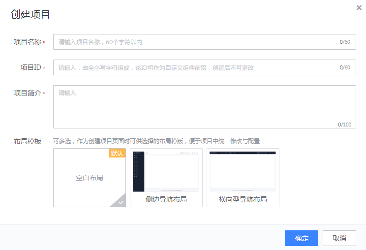
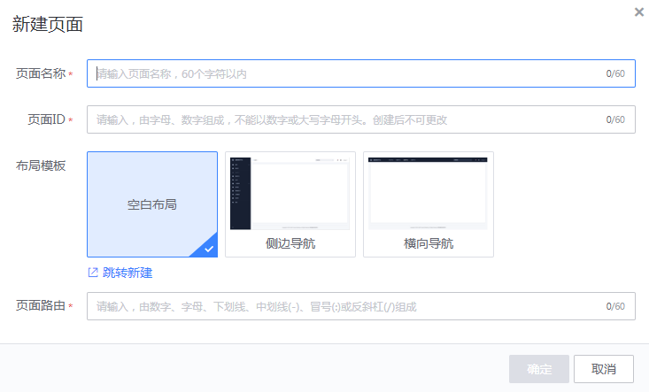
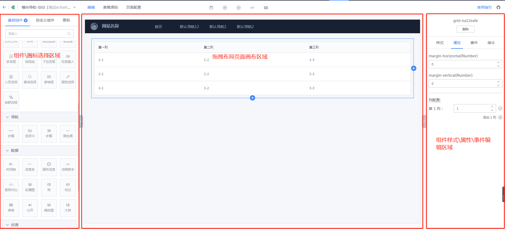
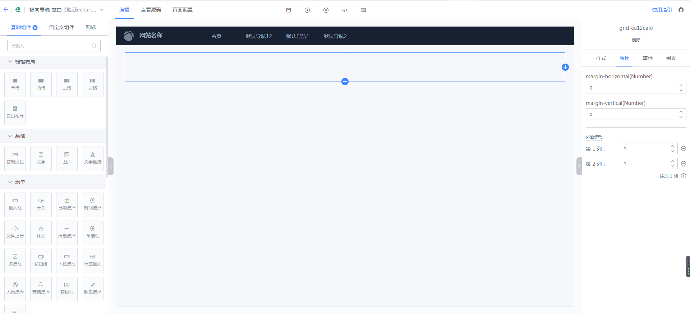
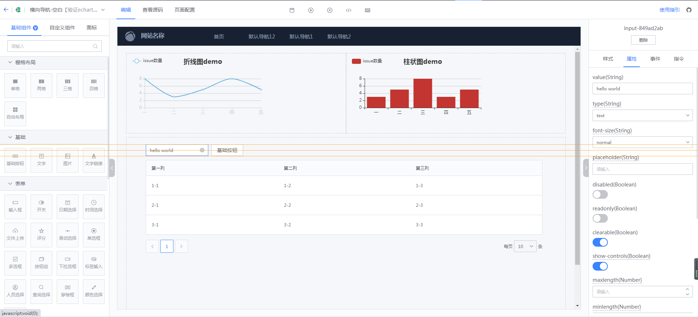
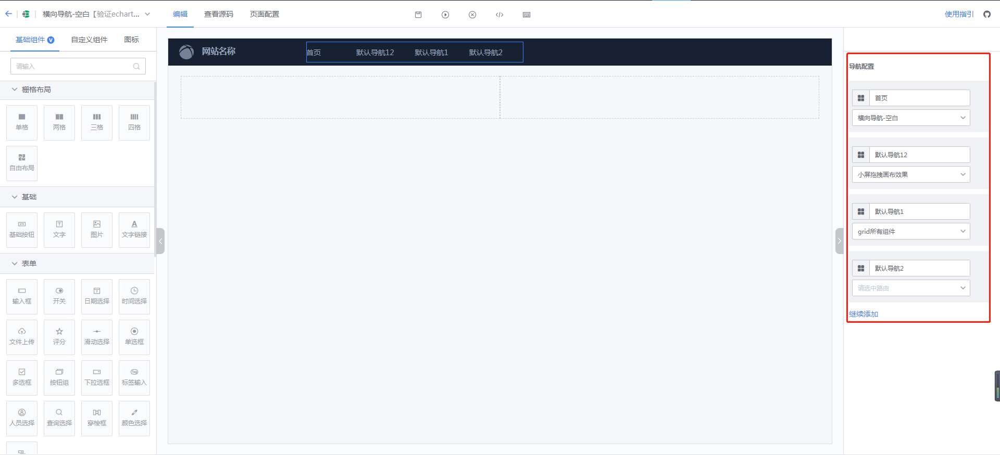
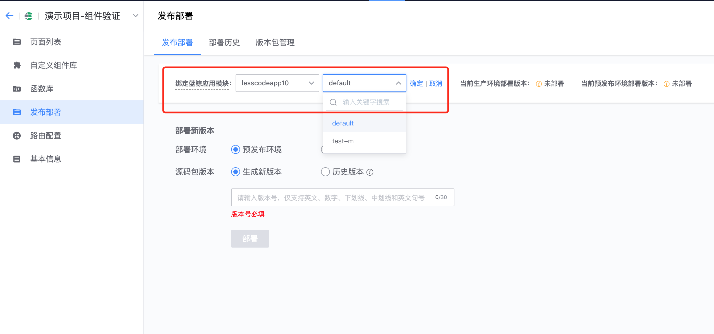
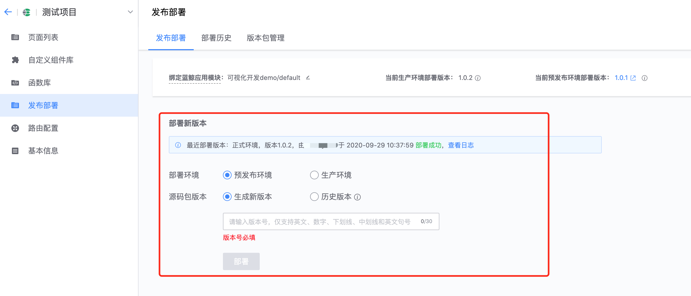

## 快速上手

## 1. 创建应用

进入蓝鲸可视化开发平台后，你可以“创建应用”开始在线一站式研发。

注意：

1、应用ID将作为该应用自定义组件ID前缀，请谨慎命名

2、创建应用时，可选择初始化布局模板实例，可基于指定布局模板实例创建应用页面

## 2. 创建\编辑页面

进入应用“页面列表”，你可以创建多个页面，并进行页面拖拽布局编辑。

- 选择页面使用的布局导航风格

- 拖拽组件到画布区域，进行配置

### 2.1 组件选择区域

- 基础组件：包含蓝鲸Vue组件库提供的基础通用PC端组件
- 自定义组件：包含当前应用内上传的自定义组件库及其它应用公开的自定义组件

### 2.2 画布区域
- 第一步：拖拽组件“栅栏布局”或“自由布局”到画布中，比如“二格”栅栏

    

- 第二步：再拖拽其它组件到“二格”栅栏布局和自由布局里

    

- 第三步：编辑组件样式、属性，绑定事件函数

- 第四步：配置页面导航

    

- 第五步：预览，保存页面

## 3. 函数库
你可以创建、管理应用页面所需要使用的JS函数。平台提供了两款示例函数供参考。
- getMockData：基于空白函数模板，获取远程API获取Mock数据
- getApiData：基于远程函数模板，填写远程API调用信息，函数本身仅处理远程API返回数据即可

函数可用于组件事件绑定或组件数据源获取。

### 注意
- 函数中调用的远程API可以是任意系统提供的API，比如你开发的蓝鲸SaaS提供的API、蓝鲸APIGateway提供的云API
- 函数中调用远程API，可能会遇到跨域问题及API权限校验问题，具体按远程API要求进行调用。

## 4. 自定义组件库
页面编辑组件选择区域，除了蓝鲸提供的基础通用组件，你还可以上传自己研发的业务场景组件。

注意：
- 须遵循平台提供的自定义组件规范进行组件开发
- 组件配置（config.json）中“type”属性必须以“应用ID”为前缀，即：应用ID-xxx
- 组件上传包必须是使用平台提供的打包工具打包后再上传

## 5. 发布部署
应用页面编辑完成后，可以直接发布部署到蓝鲸PaaS平台。

- 第一步：需要先在蓝鲸PaaS平台创建“源码管理”类型为“蓝鲸可视化开发平台提供源码”的应用或应用模块

    例如：应用名为“lesscodeapp10”，模块名为“lesscodedemo”

    

- 第二步：在"应用" -> "发布部署"页面，绑定第一步创建的蓝鲸应用及模块

    

- 第三步：选择需要部署的环境及版本进行部署

    

## 6. 二次开发
如果你对拖拽出来的页面需要进行二次开发，可参考如下方式进行：

### 方式一：下载应用全部源码
平台将把应用所有页面源码及页面路由配置集成到蓝鲸前端开发框架（BKUI-CLI）框架中，下载后的源码包可以直接在蓝鲸PaaS平台部署。

### 方式二：下载单页面源码
如果是已有开发中应用，只需要拖拽单独页面进行二次开发，你可以只下载单页面的源码放入你已有开发中应用工程代码中即可。

