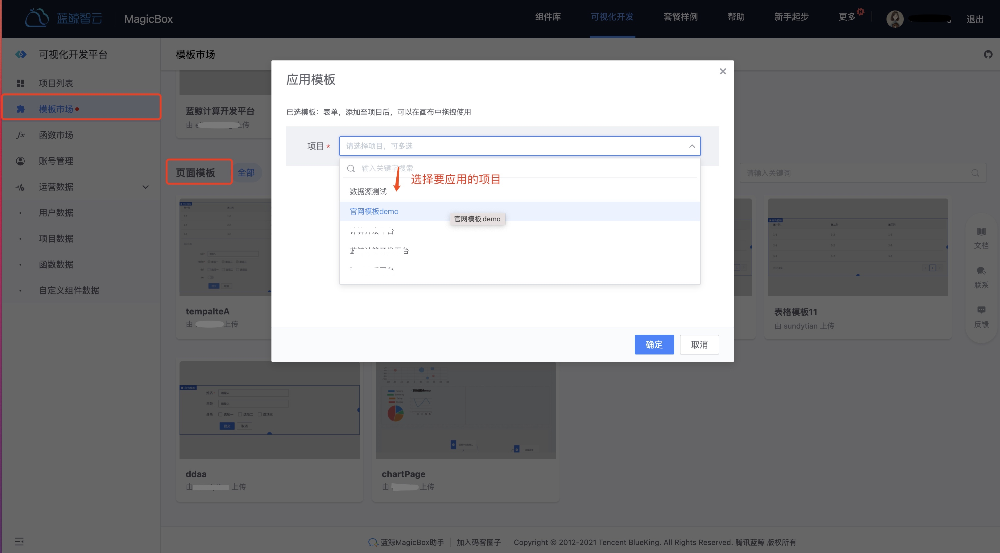
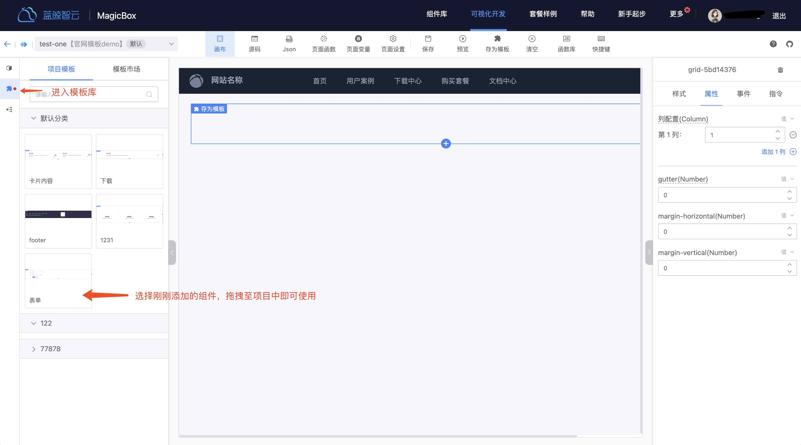
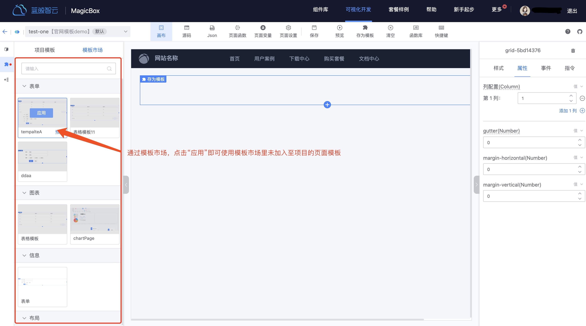
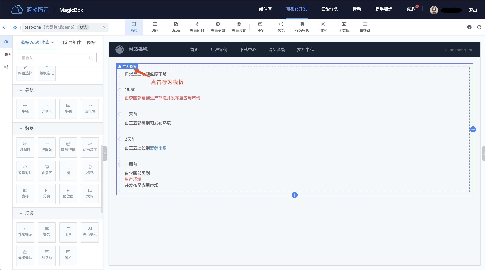
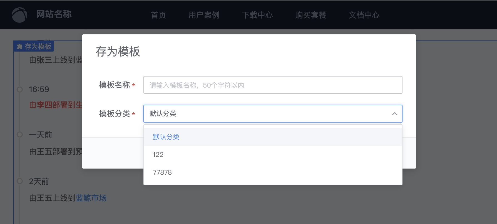
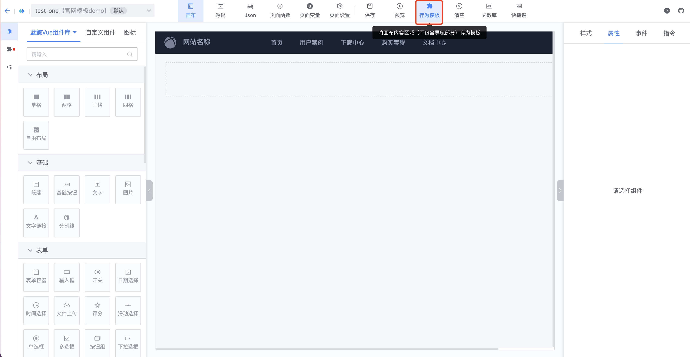
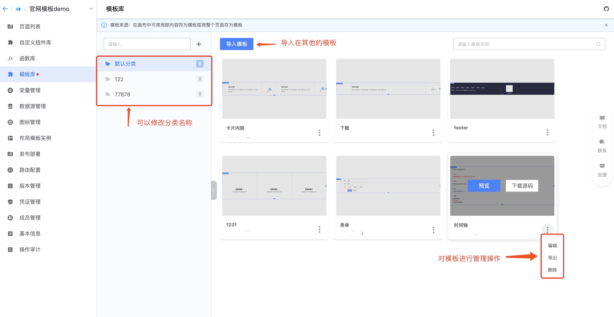
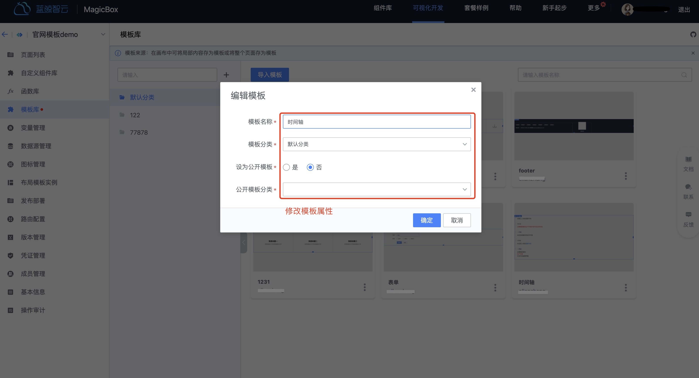
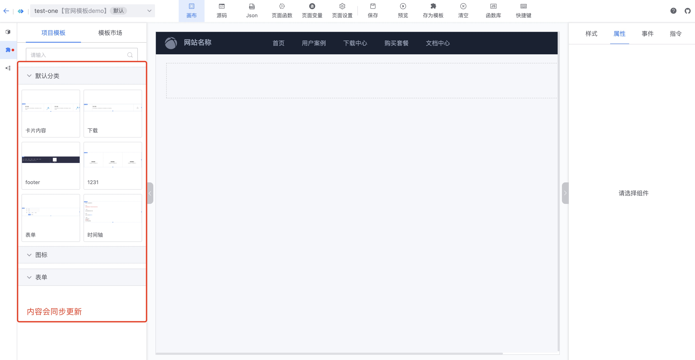

## 页面模板的使用指引
lesscode 提供了两种不同粒度的模板，应用级模板和页面模板，页面模板是较应用级是更低粒度的模板，可以灵活的应用在各个页面当中。

### 如何使用页面模板？

### 第一种：通过模板市场添加至应用当中
1.进入模板市场，选择合适的模板，然后添加至应用
 
 
{width="80%"}

 
2.在添加完成后，就可以在画布模板库里使用了
 
 

 {width="80%"}

### 第二种：通过画布的模板市场添加

在画布的模板市场也可以快捷的添加页面模板，有黑色遮照部分代表未添加至应用的页面模板，点击“应用”，即可在应用中快捷使用。
 
 

{width="80%"}

### 存储模板

 在页面的排版过程中，也可以将页面内容存为页面模板，实现局部内容的快速复用。
 
  
 1.选中对应的模块，点击“存为模板”
 
 

 {width="80%"}

 
2.填写要存入的模板分类
 
 

{width="80%"}

 
3.还可以在画布中直接将某个页面的内容存为页面模板（不包含导航内容），可以嵌入进任何形式排版的页面
 
 

{width="80%"}

### 如何管理模板？

对于从市场中添加的模板和自定义的模板，我们提供了专门的模板管理功能，用户可以自定义分类管理，以及对模板进行编辑、删除，导出等管理。

 
1.进入应用模板库管理，可以导入新的模板（支持json 格式）、修改分类名称、模板的属性等等
 
 

{width="80%"}
{width="80%"}

 
2.修改后的效果会同步至画布中的模板
 
 

{width="80%"}
