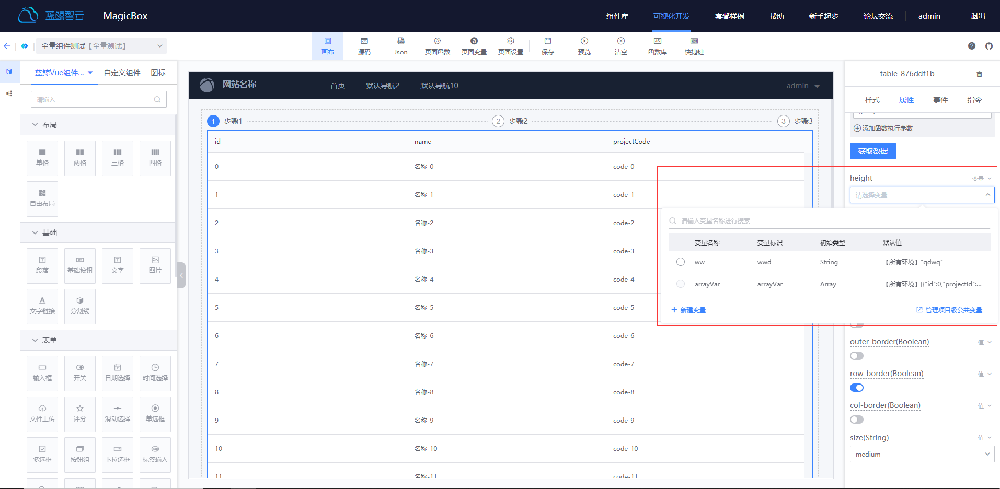
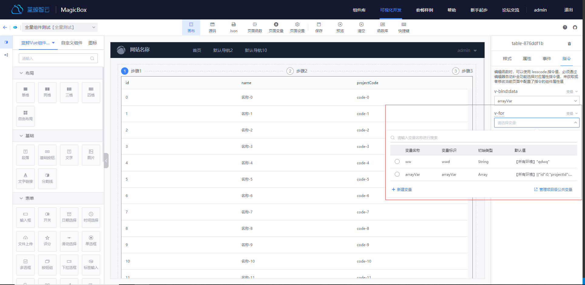
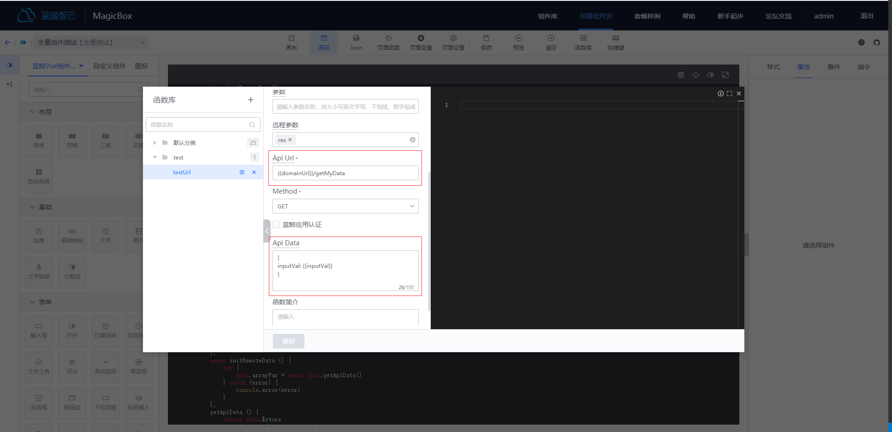

## 变量使用指引
---
蓝鲸可视化开发平台中：可以由用户创建变量，并在页面中使用变量。通过使用变量，可以完成以下需求：
* 给组件属性动态赋值：将变量与属性绑定，后续可以通过函数操作变量来获取或者修改变量的值，来影响组件的属性
* 给组件指令动态赋值：目前平台提供了 VUE 语法中的指令，将变量与指令绑定，可以通过函数操作变量来控制指令的表现，具体指令的表现可以参考[VUE指令文档](https://cn.vuejs.org/v2/api/#%E6%8C%87%E4%BB%A4)
* 全局变量：可以在项目定义全局变量，每个页面共享这个变量的值
* 环境变量：一个变量可以分别配置在生产环境和预发布环境下的值，做为该变量的初始值
* 函数参数使用变量：函数的 Api Url 和 Api Data 可以使用变量来动态获取值

### 全局变量管理
---
#### 全局变量管理页面路径：
首页 -> 项目管理 -> 变量管理
#### 全局变量管理页说明：
* 可以在本页面对全局变量进行增删改查操作
* 已经使用的变量不允许删除，只有管理员和自己创建的变量才有删除权限
* 全局变量的变量标识是全局唯一
* 在页面中修改了全局变量的值，其它页面使用到该变量的地方值也会一起被修改

### 页面变量管理
---
#### 页面变量管理页面路径：
页面 -> 画布编辑 -> 页面变量
#### 页面变量管理页说明
* 该页面展示了本页面可用的变量详情（包含了全局变量和本页的页面变量）
* 只能操作页面变量，全局变量需要到全局变量管理页进行操作
* 已经使用的变量不允许删除，只有管理员和自己创建的变量才有删除权限
* 可以在本页面对页面变量进行增删改查操作

### 变量初始类型介绍
---
蓝鲸可视化开发平台目前提供了七种变量初始化类型，以便业务发开使用，该类型只做为初始化的类型，后续可以在函数中对变量进行修改。将来会添加更多的变量初始化类型，敬请期待
* 普通数据类型（String，Number，Boolean，Array，Object）：即 JS 数据类型，在绑定给属性的时候，会基于数据类型进行过滤
* 图片地址：用户可以上传一张图，然后该图片可以在画布中绑定到可以使用图片的属性上
* 计算变量：可以根据多个变量或者函数进行组合，最后返回一个值，该变量可以应用到所有的属性和指令上。计算变量具体用法可以参考[VUE计算属性文档](https://cn.vuejs.org/v2/guide/computed.html#%E8%AE%A1%E7%AE%97%E5%B1%9E%E6%80%A7)

### 变量与属性绑定
---
:::info
在项目页面编辑页面，鼠标单击选择相应的组件，在右侧的配置面板，选择`属性`tab，选择想要绑定变量的属性，然后右上角切换为变量，即可选择变量。也可以切换成值和表达式，表达式可以直接写变量标识来使用变量，编写最终是JS的表达式
:::

### 变量与指令绑定
---
:::info
在项目页面编辑页面，鼠标单击选择相应的组件，在右侧的配置面板，选择`指令`tab，选择想要绑定变量的指令，选择变量即可。也可以切换成值和表达式，表达式可以直接写变量标识来使用变量，编写最终是JS的表达式
:::

### 变量与函数绑定
---
:::info
函数的Api Url 和 Api Data可以使用变量：如图所示，可以使用`{{变量标识}}`在参数中使用变量
:::

 
